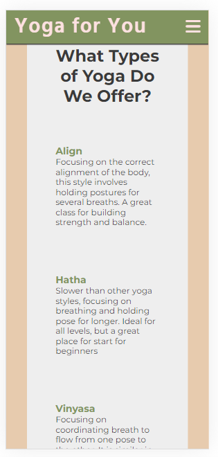
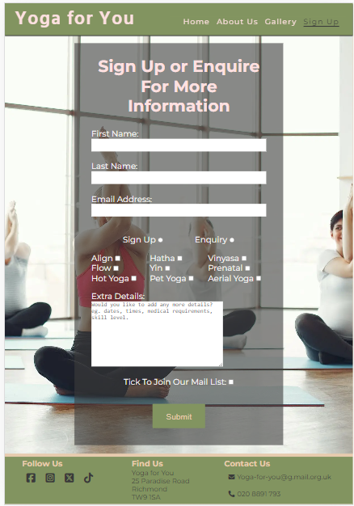

# Yoga For You - Portfolio 1: HTML and CSS

Yoga For You is a static website which is designed to be responsive, to allow visitors to view on a range of devices. It allows visitors to find out about the yoga studio. 

# Purpose

This project is a static website which promotes a fictional Yoga company, Yoga For You. It aims to provide information to the user about what types of yoga the company offers, who the instructors are, the times of the classes, and testimonials. It allows for the user to sign up or enquire more about the classes the company offers.

The core purposes of the website:

- introduce the yoga studio to customers
- allow viewsers to see what types of yoga are offered at the studio
- to allow ways for viewers to contact the studio.

This site is based on a fictitious company. The project was developed for project 1 HTML and CCS unit of Code Institute's Disploma in Full Stack Software Development.

[The live website is available here](https://emilycheatham.github.io/p1_yoga_for_you/)
___

# User Experience (UX)

## User stories

### As a **first time user**

- I want to be able to navigate the wste easily to find the content I need.
- I want to know where the studio is.
- I want to know what types of yoga are offered and which one would suit me.
- I want to know the cost of the classes.
- I want to know when the classes are offered to see which one would suit me.
- I want to know what things I need to bring.
- I want to be able to contact the studio.

### As a **returning** and a **frequent user**

- I want to find I want to find up-to-date information about class times.
- I want to be able enquire about classes or sign up to classes.
- I want to be able to contact the studio.

### All users

- All users want to be able to confortably view and access the wesbite on different devices.

___

## Structure
The website it comprised of five main pages, four of which are accessible from the navigation menu (home, about us, gallery, sign up.) The fifth page is a thank you page which is shown once the user submits the form with an enquiy or signing up on the sign-up page.
All pages on the website have: 

- A responsive naviagation bar at the top, which is static so it is accesible at all times. To the left of the navigation bar is the logo. To the right of the navigation bar, there are links to the pages - home, about us, gallery, sign up. To allow for a good user experience, on mobile devices, the nav bar is hidden through the use of a media query and will display as a burger toggler.
- A footer which contains social media links to facebook, intstagram, twitter and tik-tok. There is the studio's address and phone number. The email address is an anchor, and will open up email in a new tab.

### Home Page

- Grabs the users attention with a clear image of yoga. 
- Draws the eye to the name of the Yoga studio and where to find the studio.
- Introduces the benefits of yoga and the types of yoga the studio offers.
- Provides clear links to relevant pages to find out more infomation.

#### User Goal
    
    > - To understand the benefits of yoga
    > - To understand the different types of yoga the studio offers. To have enough information to know what class would be most suitable for their abilities and/or needs.
    > - Easily navigate and interact with the website.
    > - To be able to find and contact the studio.
    
#### Website Goal
    
    > - Interest and engage the user.
    > - Provide them knoweldge of the yoga the studio offers
    > - Easy navigation to the relavent pages.
    > - Provide ways to contact eg. phone, e-mail, address, socials
    
### About Us Page

- Introduces the Team at the studio - their names and classes they run.
- Provides the length of the class.
- Provides information on equipment provides and required.
- Provides the cost: per class and membership
- Provides the times for each type of class per day.

#### User Goal
    
    > - To know the lenght of the classes.
    > - To know what times the classes are for each type of yoga, and on each day, in order to select the class that best suits their lifestyle.
    > - To know the prices - per class and for membership.
    > - To know what equipment is needed.
    
#### Website Goal
    
    > - Present the yoga teachers, to help set the ethos.
    > - Provide clear information on classes: length, price, times.
    > - Interactive timetable to make it easier to view set yoga types.
    > - Interactive event classes to engage interest.

### Gallery Page

- Provides a range of photos which include a range of ages, genders, abilities and classes.
- Provides testimonials from customers about their experiences

#### User Goal
    
    > - To view images of the studio to get a feel for the ethos, the studio size and space.
    > - To see images of the different types of classes to guage where they would be interested or feel able.
    > - To read testimonials from current customers
    
#### Website Goal
    
    > - Set ethos of club
    > - Range of photos of abilites, classes, ages and ability to promote inclusivity.
    > - Postivitive testimontials to promote the studio and the instructors.

### Contact Us Page

- Allows the users to sign up or make an equiry about one or more class.
- Allows the user to join the mailing list.

#### User Goal
    
    > - To be able to contact the studio with an enqiry.
    > - To be able to sign up to a class.
    > - To join the mailing list.
#### Website Goal
    
    > - Provide a clear way for both new customers and existing members to contact the studio to enquire or sign up for a class.
    > - To provide option to sign up to the mailing list.
    

### Thank you Page

- Once the form has been submitted on the Sign Up page, the user is redirected to the 'Thank you' page.
- Provides acknowledgement that their enquiry/sign up has been recieved.
- States when they should recived an e-mail response.
- Provides a navigation button to return home.

#### User Goal
    
    > - To be provided an acknowledgment that the request/sign up has been sent.
    > - To know how if and long it will be until you get a response.
    > - To know how to expect the resonse - via e-mail.
    > - To be able to navigate back to the home page
    
#### Website Goal
    
    > - Provide an acknowledgement.of receipt of form.
    > - Provide a clear link back to the index.html page.

___

## Wireframes

### **Home Page**

### **About Us Page**

### **Gallery Page**

### **Sign Up Page**

### **Thank-you Page**
A wire frame was not created for this page as it was decided to add this later as an acknowledgement of the form being recieved.

___

## Design

Yoga is renound for aiding mental health, and being a time to be calm, focused and in the now. As a result, the project's design arises from this theme. It aims to be calming and peaceful. It aims to have enough contrast to draw the viewer's eye to intended element, and be contrasting enought to be accessible for all users, whilst maintiaing the calming ethos. 

### Colour Scheme

The colour palette was selected to envoke feelings of calmness and relaxation. The palette was generated using the [Color hunt wesbite](https://colorhunt.co/). The green, white and pink is often echoed through yoga photos echoing the practitioner's clothes, skin and location. 

### Typography
Through the exploration of the [fontpair wesbite](https://www.fontpair.co/) the combination of the following fonts were used from Google fonts:
[Montserrat](https://fonts.google.com/specimen/Montserrat) This was was chosen for the main body as it was neutral and easy to read.

[Hind](https://fonts.google.com/specimen/Hind) was used for the headings at all levels.

### Images

The images in this project were sourced from [pexels](https://www.pexels.com/).All images on this website are free stockp hotos which are royalty free. The images were selected as they showed individuals doing yoga and different yoga classes. The studios in the image linked with the ethos and theme I was trying to create. The colours also correlated with the colour palette used. 

### Accessibility

- Active tags have been added to menus to allow screen readers to see which page is currently open.
- Aria labels have been added on all images across the site to provide information to screen readers.
- Scope labels have been used on the table to aid screen readers to view the information

### Visual Effects

#### Shadows

As it will stay at the top of the screen as you scroll down, a box-shadow was added to the nav bar to allow for it to seem like it is 3D and be seperate to the other sections.

#### Hover on images

To increase users engagment, and to reduce writing on screen for better visual effect, hover has been used on some images. When hovering over event classes, it provides information about the name, time and requirments/limiaations of the class.

#### Hover on table

To make the classes table easier to read, the whole row turns pink when hovered over. This makes it easier to see a set style of yoga and the times that class is offered throughout the week.

#### Navbar Hover effect

To make the experience more interactive, the nav bar includes a hover-over effect for desktops. The text displays as pink, but the hover is #3a3a3a to make it stand out.

#### Buttons

The submit button on the sign up page grows (1.2) when hovered over. The font also becomes underlined in pink when hovered over. When pressed, if the form is filled in correctly, it will take you to the thank-you page.

#### Links

Hover has also been used on anchors. When hovered over, they will underline the text. This can be seen in the nav and the footer. Additionally, on the homepage, two anchors have been stylised like buttons to stand out.

___

# Features

## Existing Features

- **Navigation bar**

Each page has a navigation bar at the top. It sticks at the top even if you scroll down the page. It has an identical layout on all pages, to ensure a simple and intitive nacigation. 
The navigation bar is fully responsive, changing size based on the device the user is on.The navigation bar includes the Logo (which is also a link to the Home page) and the links to Home, About Us, Gallery and Sign Up. The navigation bar allows for the user to move through the pages without having to rely on the back button.

Based on a media quesry, for mobile devices it become a dropdown "hamburger menu" feature. This allows for a better use of the space on smaller devices.

- **Hero image**

This section is the first thing the user sees opening the home page. It is clear what the site is about. It uses colours that match the colour scheme. The image involve a range of people of different ages, genders and races, showing the inclusive nature of the studio.
The semi-transparent overlay draws the eye, making it very clear what the site is about and where to find the studio. this stretches 60% over the width of the image.

On smaller devices, the semi-transparent overlay is 80% width to ensure all text is included whilst still being clear.

- **Why Practice Yoga section**
  
This section highlights the benefits of yoga.
Its layout is responsive to different devices.

- **Types of yoga offered section**

This section allows the user to have  brief overview of the different types of yoga offered in the studio. It gives enough information for users to be able to decide based on their experience and any physical requirements.
It is reponsive using flex-box to fit the text into all screen types.

- **Table for Class section**
This table is responsive. When hovered over, the row will highlight pink to make it easier to read certain types of yoga classes.
The divs are resposive. When in mobile view, the text is above the table. The table can be scrolled left to right so all information can be seen even on smaller devices with overflow.
On larger devices, the text moves to the left of the table, and the table expands to fill the width of the device's screen.

- **Gallery section**
 
This section provides 12 photos which include a range of ages, genders, abilities and classes. Set as grid, the images are all the same size. They are responsive to the device and will change how many images are on a row depending on the device size.
 

- **Sign Up section**

This section allows for users to ask an enquiry about one or more yoga class. It also allows for users to sign up for a class. Thy can select one or multiple class types. They can only do an enqury or sign up, not both. 
This form is responsive to different devices.

- **Footer**

The Footer contains the links to the social media - these are all active. It also provides the address, phone number and e-mail address. The email address will open in a new tab. The footer is responive on mobiles.

## Feature Considerations

### Signup form processing

Currently, once the form on the Sign Up page is completed, it takes you to a thank you page. The data is not being processed or stored. This is also due to it being a fictional company. However, the data would ideally be stored, processed and analysed. Using this, online booking could be made with instant feedback, instead of having to wait for an e-mail response. This would make it more efficient for the compnay, and provide a more efficient and personalised quality experience for the user. 

### Popup preview of Google Maps

In the wireframes, googlemaps was intetend to be placed in the footer. This was removed as I felt it would have been too large. This could be used in the About Us page, or as a pop up feature when the address in the footer is clicked on/hovered over.

### Link buttons
Originally the anchor links on the index page and the thank you page were buttons. They grew when you hovered over them. However, validator checks didn't like buttons and anchors together. I would like to redo these so they all look the same, and increase in size when hovered. The font would need shaning to stand out more. I would like it to link to a certain section rather than just a page.

### Accessibility

Whilst the lighthouse checks rated the accessibily in the 90's, there is still room for improvement. One of the suggestions was that background and foreground colours do not have sufficent contrast ratio. Therefore, I would intend on experimenting with changing these to improve this contrast futher whist still maintaining the colour scheme.
I would use the site I found at the end of my project, Toptal [Colorfilter](https://www.toptal.com/designers/colorfilter/)to improve access for those with colour-blindness.

___

# Technologies

- HTML to accomplish the structure of the website.
- CSS to style the website.
- [Balsamiq](https://balsamiq.com/wireframes/)- Used to create the wireframes
- Git - For version control.
- [GitHub](https://GitHub.com/) - To save and store the files for the website
- [Gitpod](https://gitpod.io/) - IDE to develop the wesbsite
- [Google Fonts](https://fonts.google.com/) - To import the fonts used on the wesbite
- [FontAwesome](https://fontawesome.com/) - For the inconography on the wesbite. v5.15.1 Icons.
- [Google Chrome Dev Tools](https://developers.google.com/web/tools/chrome-devtools)- To troubleshoot, debugging, inspecting page's elements, testing responsiveness and solvingiissues with responsiveness and styling.
- Paint - To crop images
- [CloudConvert](https://cloudconvert.com/webp-converter) and Pixelied [Pixelied](https://pixelied.com/convert/jpg-converter/jpg-to-webp) - to optomise larger images to reduce the storage and enhance wesbite performance.
- [pexels](https://www.pexels.com/) - To find and download royalty free images
- [Favicon.cc](https://www.favicon.cc/) - to create the website favicon.
- [Colorhunt](https://colorhunt.co/) - to source colour palette
- Google Chrome's [Lighthouse](https://developers.google.com/web/tools/lighthouse) - to access preformance and accesibility
- [W3C HTML Markup Validator](https://validator.w3.org/) to validate HTML code.
- [W3C Jigsaw CSS Validator](https://jigsaw.w3.org/css-validator/) to validate CSS code.
- [Markdown Tables Generator](https://www.tablesgenerator.com/) to generate tables for the readme file.
- Code Institute's Gitpod Template to generate the workspace for the project.

___

# Testing

Testing was ongoing throught the entire build. Google Chrome Developer Dev tools was utilised to pinpoint and troubleshoot any issues. Every page was viewed on Dev Tools to check responsivity on different devices. The site was also trialled on a number of browsers (Google chrome, safari, Mozilla)

# User Stories
| Expectations                              | realisations                      |
|-------------------------------------------|-----------------------------------| 
|**As a first time user**                   |                                   |
| I want to navigate the site easily        | The sticky nav bar allows the user to easily navigate on all devices and pages|
| I want to know where the studio is        | The hero image on the home page states it's in Richmond, London. The footer on all pages gives the exact address of the studio. |
|I want to know what types of yoga are offered and which one would suit me. | The home page has the 8 types of yoga offered. It gives a brief over view of what it is, who it is suitable for. The 3 event classes are explained on the home page. |
| I want to know the cost of the classes. | The price for individual classes and membership is stated on the About-Us page |
| I want to know when the classes are offered to see which one would suit me | The times of the classes are in a clear table on the About us page. |
| I want to know what things I need to bring | The about us page states the equipment the studio provides. It says you only need to bring water and a towel.|
| I want to be able to contact the studio. | Address, e-mail and phone number are on the footer of every page. The Sign up page allows for enquiries to be made. |
|**As a returning and frequent user**                   |                                   |
|I want to find I want to find up-to-date information about class times. | The about us page has the class type, the times that class is on, and which days |
| I want to be able enquire about classes or sign up to classes. | The sign up page has an option to sign up or enquire. There are also contact details on the footer if they prefer to phone |
| I want to be able to contact the studio | Address, e-mail and phone number are on the footer of every page. The Sign up page allows for enquiries to be made |
|**All users**                   |                                   |
| I want to be able to view the wesbite comfortably on my device | Aria tags have been added for screen readers. Contracting backgrounds and fonts have been used to read easily. Responsiveness on device sizes has been added |

# Solved issues

The following issues arose and were solved through testing, tutor meetings, and peer advice.

- The table was too large and was overflowing into white space - a overflow-x scroll bar was added. 
- The section that the table was in had white space on smaller devices - a div was added around the whole section and overflow: hidden was added.
- The sign up form was too small - text size was increased, padding added and block element added to the text-input.
- The text input sections overflowed out of the space, especially on smaller devices. A fiv with flex was added, and text overfolow: hidden.
- Inital testing on lighthouse raised that images were slowing down performance - images cropped and resized to fit space. Images converted to webp.

## Automated Testing

1. **[W3 Markup Validation](https://validator.w3.org/) - HTML Validation**

All pages were run through HTML Validator. No errors were detected.

- [Home Page HTML](assets/images/readme/IndexHTML.png)
- [About Us Page HTML](assets/images/readme/AboutUSHTML.png)
- [Gallery Page HTML](assets/images/readme/GalleryHTML.png)
- [Sign Up HTML](assets/images/readme/SignupHTML.png)
- [Thank You Page HTML](assets/images/readme/thankyouHTML.png)

1. **[W3 Jigsaw](https://jigsaw.w3.org/css-validator/) - CSS Validation**

CSS Stylesheet was run through CSS Validator. No errors were detected.
- [style.css CSS](assets/images/readme/CSSvalidation.png)

3. **[Google Lighthouse](https://developers.google.com/web/tools/lighthouse)**

**Home Page**

Mobile

Desktop

**About Us Page**

Mobile

Desktop

**Gallery Page**

Mobile

Desktop

**Signup Page**

Mobile

Desktop

**Thank-you Page**

Mobile

Desktop

___

# Deployment

This project was deployed to GitHub pages. The steps to deploy are as follows:

1. Log in (or sign up) to Github.
2. Find the repository for this project, Yoga For You.
3. Click on the Settings from the Repositories sub-headings.
4. Click on the Pages link in the left hand side navigation bar.
5. In the Source heading, choose main from the drop down select branch menu. Select Root from the drop down select folder menu.
6. Click Save. 
7. A message that the website is ready to be deployed will apprear. Reresh the page and the link to the deployed site will be available.
8. Your live Github Pages site is now deployed at the URL shown.

The live link can be found [here](https://emilycheatham.github.io/p1_yoga_for_you/).

## How to run this project Locally

- **Clone the repository**

1. Log in (or sign up) to GitHub.
2. Navigate to the GitHub Repository for this project, emilycheatham/p1_yoga_for_you
3. Click the code drop-down menu. Select whether you would like to clone with HTTPS, SSH or GitHub CLI and copy the link shown.
4. Open a terminal in the directory of your choice, type 'git clone' and paste the link from step 3.
5. A clone of the repository will now be created on your machine.
___

# Credits

## Code

 - Tutorials from  Love Running Project were followed for the Love Project. This was used as a base structure for the design.
- Hover over images hover effect developed by following 

## Content

Content for the wesbite was written by the owner Emily Cheatham

Readm.md file was created based on the structure of ![Sofing]<https://github.com/oks-erm/sofing/blob/main/README.md> and 

## Media

- All images were taken from [pexels](https://www.pexels.com/).

## Acknowledgements

I would like to thank my mentor, Ronan McClelland, for his valuable guidance and support through the project.

I would like to thank Craig Hudson for helping me realise there was an issue with my port.

I would like to thank the Slack community for answering questions before I even had them. And especailly Kellie who took the time to peer review my project, picking up on spelling issues and pointing me in the direction of a good ReadMe.md structure.
___
